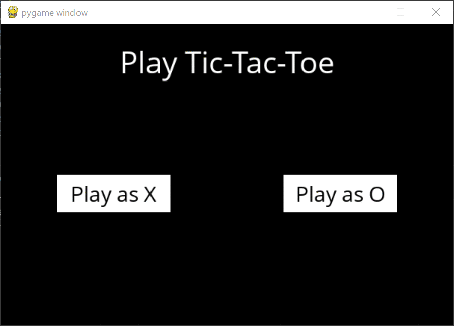

# TicTacToe

TicTacToe game built using pygame. AI designed using minimax algorithm. 

Example Game: 


### Instructions to Use:

```console
git clone https://github.com/prithvijitguha/tictactoe.git
pip3 install -r requirements.txt   
python runner.py
```
